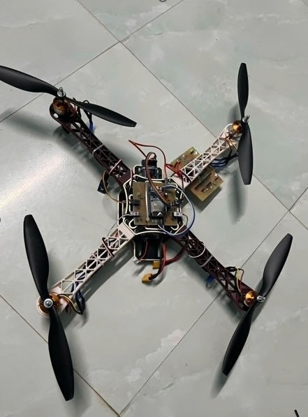

# 🛸 ESP32 Drone Project

## 🚀 Giới thiệu

Đây là một dự án **Drone 4 cánh (quadcopter)** sử dụng **ESP32** để điều khiển. Drone có thể nhận tín hiệu từ tay điều khiển RC, tự động giữ thăng bằng nhờ cảm biến, hiển thị thông tin môi trường (nhiệt độ, độ ẩm), và hỗ trợ giám sát từ xa qua giao diện Web.

## 🧠 Tính năng chính

- ✈️ Điều khiển 4 động cơ/quạt bằng tín hiệu PWM.
- 🎮 Nhận điều khiển từ tay điều khiển RC qua 6 kênh.
- 📐 Ổn định bay với dữ liệu từ cảm biến con quay (IMU).
- 🌡️ Đo nhiệt độ và độ ẩm với cảm biến DHT11.
- 🌐 Tạo Web Server để hiển thị thông tin thời gian thực (qua WiFi).
- ⚙️ Sẵn sàng mở rộng thêm PID, GPS, đo pin, tự động hạ cánh,...

## ⚙️ Phần cứng sử dụng

| Thiết bị             | Mô tả                              |
|----------------------|-------------------------------------|
| ESP32 DevKit         | Bộ vi điều khiển chính              |
| 4x ESC + Động cơ     | Điều khiển tốc độ quay cánh quạt   |
| Remote điều khiển RC | Gửi tín hiệu PWM (6 kênh)          |
| Cảm biến DHT11       | Đo nhiệt độ, độ ẩm                 |
| Cảm biến MPU6050 (*) | Đo tốc độ quay và góc nghiêng     |
| Nguồn pin LiPo       | Cấp điện cho drone                 |

## 🌐 Giao diện Web

Khi ESP32 kết nối WiFi thành công, có thể truy cập địa chỉ IP nội bộ (ví dụ: `192.168.1.xxx`) để xem nhiệt độ, độ ẩm hoặc điều khiển/giám sát.

